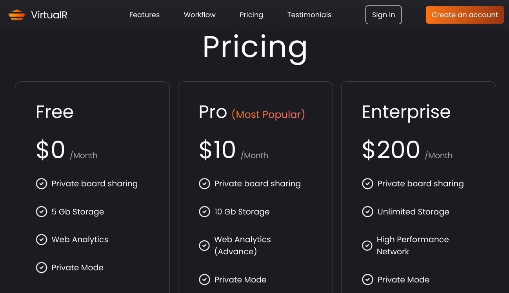

 

# Virtualr

Virtualr - a Modern react 18 Website for a vitrual company website.

## Functionalities

👉 **Beautiful Sections**: Includes hero, services, features, how to use, roadmap, pricing, footer, and header.

👉 **Responsive**: Ensures seamless functionality and aesthetics across all devices

and many more, including code architecture and reusability

## Technologies Used

- **React**: Frontend framework for building dynamic and interactive user interfaces.
- **vite** : a build tool that aims to provide a faster and leaner development experience for modern web projects.

## Screenshots

## Getting Started

To run the project locally, follow these steps:

1. Clone the repository: `git clone <repository_url>`
2. Navigate to the project directory: `cd virtualr`
3. Install dependencies: `npm install`
4. Start the development server: `npm run dev`